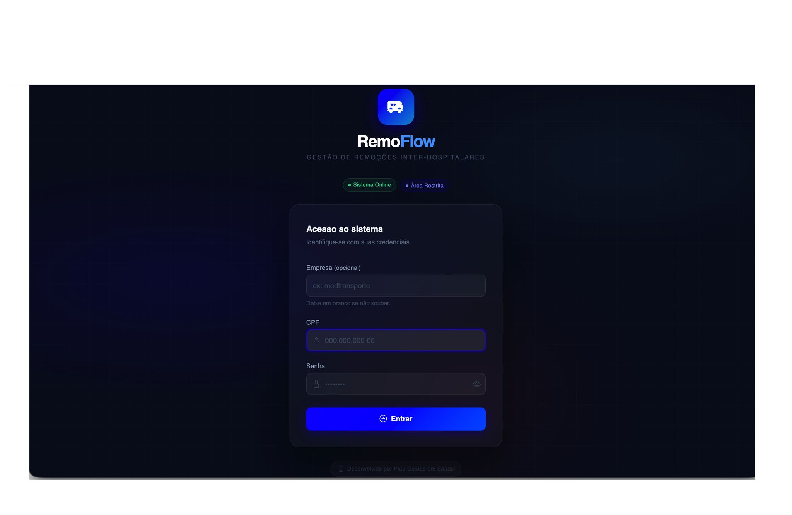
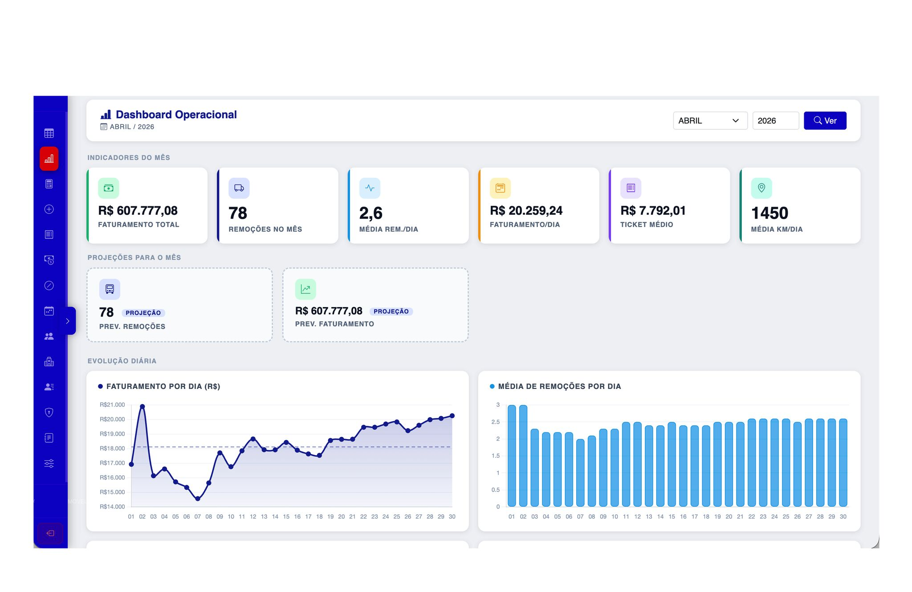
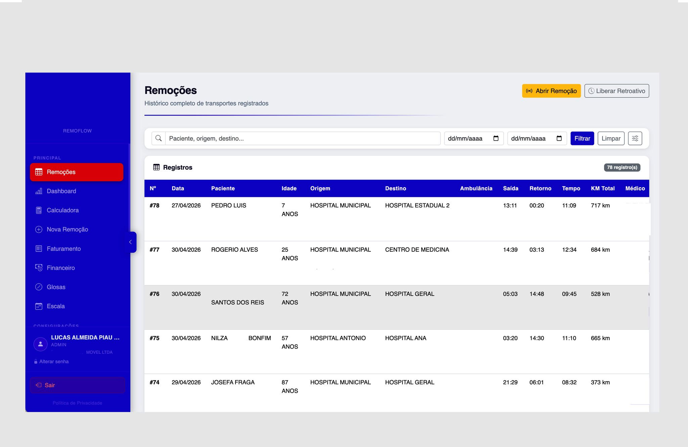
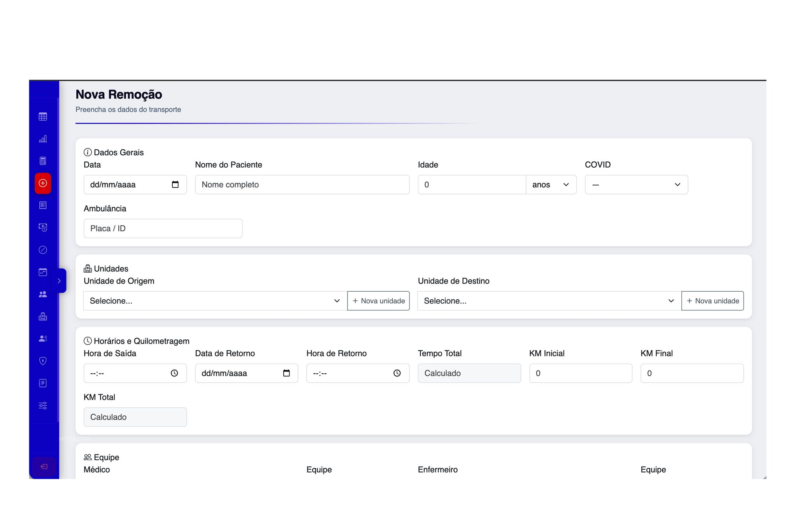
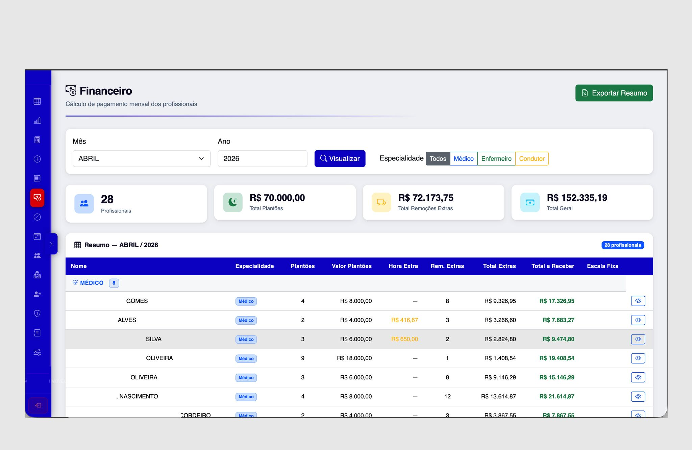

# RemoFlow

**Sistema web de gestão para empresas de transporte inter-hospitalar.**

Empresas de UTI móvel gerenciam centenas de transportes por mês — cada um com dados de paciente, equipe, trajeto, horários, quilometragem e valores a receber. Na prática, isso vivia espalhado em planilhas, às vezes no papel. O RemoFlow foi construído para resolver esse problema: um sistema único que cobre do registro da remoção até o cálculo do que cada profissional vai receber no mês.

Está em operação real com empresa piloto.

---

## Telas

### Login


### Dashboard Operacional
KPIs do mês em tempo real: faturamento, volume de remoções, ticket médio, km médio diário e projeções.



### Listagem de Remoções
Histórico completo com busca por paciente, origem, destino e filtro por período.



### Registro de Nova Remoção
Formulário estruturado com cálculo automático de tempo total e quilometragem.



### Módulo Financeiro
Cálculo mensal de pagamentos por profissional, separado por especialidade (médico, enfermeiro, condutor), com exportação em Excel e PDF.



---

## Funcionalidades

| Módulo | O que faz |
|--------|-----------|
| Remoções | Registro, edição, exclusão e listagem paginada de transportes |
| Dashboard | KPIs e gráficos mensais — faturamento, volume, km, ticket médio |
| Faturamento | Cálculo por remoção + exportação Excel |
| Financeiro | Pagamentos mensais por profissional + exportação Excel e PDF |
| Escala | Calendário mensal de plantões — manual e automático via remoções |
| Profissionais | Cadastro por empresa (médicos, enfermeiros, condutores, recepcionistas) |
| Hospitais | Cadastro global de unidades com cidade e sigla |
| Ambulâncias | Gestão da frota por empresa |
| Usuários | CRUD completo com perfis de acesso e reset de senha |
| Admin Geral | Painel do operador do sistema: gestão de empresas e impersonation |
| Auth | Login com seleção de empresa, primeiro acesso e troca de senha |

---

## Perfis de acesso

| Perfil | Acesso |
|--------|--------|
| SuperAdmin | Painel admin geral — gestão de todas as empresas |
| Admin | Acesso total à empresa + gestão de usuários |
| Recepcionista | Remoções, profissionais, escala, hospitais, cadastros |
| Faturamento | Faturamento, financeiro, remoções, profissionais |
| Financeiro | Faturamento e financeiro (somente leitura operacional) |

---

## Stack

- **Backend:** Python 3.13 / Flask
- **Banco (desenvolvimento):** SQLite
- **Banco (produção):** PostgreSQL 16 via Railway
- **Frontend:** Bootstrap 5 + Jinja2
- **Exportação:** openpyxl (Excel) · reportlab (PDF) · Pillow (logo)
- **Segurança:** Flask-WTF (CSRF) · Flask-Limiter · werkzeug.security
- **Servidor:** gunicorn

---

## Rodando localmente

```bash
# 1. Clonar e criar ambiente virtual
git clone https://github.com/seu-usuario/remoflow.git
cd remoflow
python -m venv venv
source venv/bin/activate  # Windows: venv\Scripts\activate

# 2. Instalar dependências
pip install -r requirements.txt

# 3. Configurar variáveis de ambiente
cp .env.example .env
# Edite o .env e defina uma SECRET_KEY

# 4. Iniciar (banco é criado automaticamente)
python run.py
# Acesse em http://localhost:5001
```

**Primeiro acesso:**
- CPF: `00000000000`
- Senha: `123456`
- Perfil: SuperAdmin

---

## Variáveis de ambiente

| Variável | Obrigatória | Descrição |
|----------|-------------|-----------|
| `SECRET_KEY` | Sim | Chave da sessão Flask. A aplicação não sobe sem ela. |
| `DATABASE_URL` | Não | URL PostgreSQL. Se ausente, usa SQLite local. |
| `SESSION_TIMEOUT_MINUTES` | Não | Timeout de inatividade (padrão: 30 min) |
| `PORT` | Não | Porta do servidor (padrão: 5001) |
| `FLASK_ENV` | Não | `production` desativa o modo debug |

---

## Arquitetura multi-tenant

Cada empresa cliente acessa apenas seus próprios dados, isolados por `empresa_id` em todas as queries. O painel `/admin-geral` é exclusivo do operador do sistema e permite impersonation para suporte.

A camada `database.py` inclui wrappers `_PgConn`/`_PgCursor` que fazem o psycopg2 se comportar como sqlite3 — convertendo `?` → `%s` e retornando rows com acesso por nome de coluna. Isso permite o mesmo código rodar nos dois bancos sem alteração.

---

## Status

**Em produção** com empresa piloto desde 2024. Todos os módulos da tabela acima estão completos e funcionando.

Desenvolvido por [Lucas Piau](https://linkedin.com/in/lucaspiausantana) · [Piau Gestão em Saúde](https://github.com/seu-usuario)
